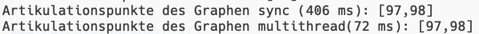
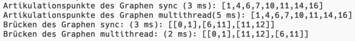

# Multicore Optimization

The reason for the project is to deal with asynchronous methods and how they can affect the performance.
We will look at the changed methods and compare them with the previous implementation.

```
https://github.com/Thub543/MulticoreOptimization.git
```


To execute the program in the CLI:
```
dotnet run -c Release
```

### GetEdgeSeparatorsParallel()

This is the original implementation of the GetEdgeSeparators method, which is responsible for identifying bridges in a graph.
```
public IEnumerable<int[]> GetEdgeSeparators()
    {
        var subgraphCount = GetSubgraphs().Count();
        for (int node1 = 0; node1 < NodeCount; node1++)
            for (int node2 = 0; node2 <= node1; node2++)
                if (_adjacency[node1, node2] > 0)
                {
                    var newGraph = RemoveEdge(node1, node2);
                    if (newGraph.GetSubgraphs().Count() > subgraphCount)
                        yield return new int[] { node2, node1 };
                }
    } 
```
As we can see, the method has a synchronous flow.


So now let's run the new implementation with parallelization.
```
    public async Task<List<int[]>> GetEdgeSeparatorsParallel() {
        var subgraphCount = GetSubgraphs().Count();
        List<int[]> result = new();
        var tasks = new Task[NodeCount];
        for (var node1 = 0; node1 < NodeCount; node1++) {
            var n = node1;
            tasks[node1] = Task.Run(() => {
                for (var node2 = 0; node2 <= n; node2++) {
                    if (_adjacency[n, node2] <= 0) continue;
                    var newGraph = RemoveEdge(n, node2);
                    if (newGraph.GetSubgraphs().Count() <= subgraphCount) continue;
                    lock (result) {
                        result.Add(new int[] { node2, n });
                    }
                }
            });
        }
        await Task.WhenAll(tasks);
        return result;
    }
```

At first glance there is not much difference from before it does its main task as it should do, but a small optimization has been added.

A task array is instantiated to collect the tasks that will be created later.
Then a task is started for each node in the first loop to check if the node is a bridge node or not.
We can start the tasks for the calculation of each node in parallel. 
This is possible because we don't need the results of previous calculations.

Then ```await Task.WhenAll(tasks);``` is used to wait on all tasks until all tasks are finished

But there are two more things to mention:

1. var n = node1

Multiple tasks would access node1 which means multiple tasks accessing shared memory. 
This can lead to problems so you have to be very careful to identify and use the shared memory correctly.

Our problem is the latency of the start of the task. 
The loop counts node1 to its maximum value and this (invalid) value would be used which in a task which will
lead to an IndexOutOfRange at _adjcency. 
This is also called race condition, more than one threads trying to do something with the value, 
in this case the for loop thread wins.

By assigning node1 to a local variable n inside the loop, you ensure that each task captures a separate 
variable with a separate value, so each task gets its own, correct value for the node it's supposed to process.


2. lock()

["It is safe to perform multiple read operations on a List<T>, but issues can occur if the collection is modified while it's being read.
To ensure thread safety, lock the collection during a read or write operation."](https://learn.microsoft.com/en-us/dotnet/api/system.collections.generic.list-1?view=net-7.0#thread-safety)

Lists are not thread-safe, the solution for this is to implement a lock where the tasks write accesss get executed step by step.

Another solution would be to use a Concurrent Collection which is thread-safe.

#### Comparison 

The graph "performancetest_100n.csv" is used for this comparsion.


The synchronous method needs 10300ms (10s) and the asynchronous only 1800ms (1.8s).(With M1 pro)

As you can see there is a big performance difference between the two implementations.

But you have to keep in mind that the creation of tasks also need a lot of ressources,
which means if you know that you only have to work with small graphs or other not so computationally 
intensive processes you don't have to use multithreading.

Multithreading is not always faster, I will give an example later.


### GetArticulationsAsync()

``` 
   public IEnumerable<int> GetArticulationsSync()
    {
        var subgraphCount = GetSubgraphs().Count();
        // Geht die Knoten 0, 1, ..., NodeCount-1 durch.
        foreach (var node in Nodes) {
            var newGraph = RemoveNode(node);
            if (newGraph.GetSubgraphs().Count() > subgraphCount)
                yield return node;
        }
    }
 ```  

 ```
    public async Task<List<int>> GetArticulationsAsync() {
        var subgraphCount = GetSubgraphs().Count();
        var tasks = new List<Task<int>>();  
        foreach (var node in Nodes) {
            var task = Task.Run(() => {
                var newGraph = RemoveNode(node);
                if (newGraph.GetSubgraphs().Count() > subgraphCount) 
                    return node;
                return -1;
            });
            tasks.Add(task);
        }
        await Task.WhenAll(tasks);
        return tasks.Select(s => s.Result).Where(n => n != -1).ToList();
    }
```

Here we have again a similar use case as before.

Each node must be removed and then we look if there are more subgraphs than before.
The calculations are independent of each other, which again makes it a perfect case for an asynchronous method.

The implementation here is again quite similar to before.

To avoid writing to shared memory and the need for a lock, our task can return the calculated value. 
This value is the matching node or -1.


### Comparison Articulations and smaller graph




Again,as you can see again that the asynchronous version is much faster. (With M1 pro)



But let's calculate a smaller graph. (With M1 pro)

As you can see in both calculations both asynchronous methods were slower than the synchronous one.

Why? For the instantiation of tasks to be profitable, the computation must require a certain amount 
of work so that the added value of the tasks outweighs the time required to create them.


### CalcDistanceMatrix()

Now you might think why not use parralelization everywhere. Here is an example where it does not work.


```
    private void CalcDistanceMatrix()
    {
        //instantiation
        for (int row = 0; row < NodeCount; row++)
            for (int col = 0; col < NodeCount; col++)
            {
                if (row == col) { _distanceMatrix[row, col] = 0; continue; }
                var weight = _adjacency[row, col];
                if (weight > 0) { _distanceMatrix[row, col] = weight; continue; }
            }
         
        //We go from i to k to j (i -> k -> j) and measure the distance. If the new distance
        // is smaller than the stored one, we write it into the distance matrix. So we find the
        // smallest distance between 2 nodes. The k nodes are necessary, because the nodes are not
        // directly connected.
        for (int k = 0; k < NodeCount; k++)
            for (int i = 0; i < NodeCount; i++)
                for (int j = 0; j < NodeCount; j++)
                {
                    var dist = _distanceMatrix[i, k] + _distanceMatrix[k, j];
                    if (_distanceMatrix[i, j] is null || _distanceMatrix[i, j] > dist)
                        _distanceMatrix[i, j] = dist;
                }
    }
```

It is important to recognize that the calculations are dependent on each other. This means that parallelization can not be applied.

What I didn't really mention before, it is important to note 
that parallelization can only be applied if the calculations that are made are independent of each other, 
because tasks will not always finish at the same speed so it can happen that a value is needed for a calculation 
that does not yet exist or it might go well but the result is not correct.

In the example, the problem is that a node from the previous calculation is needed to see if the node has changed 
and there would be a large access to a shared memory(the distancematrix before)


### Solution with Single Core
[Single Core Readme](https://github.com/schletz/GraphenprogrammDotNet)